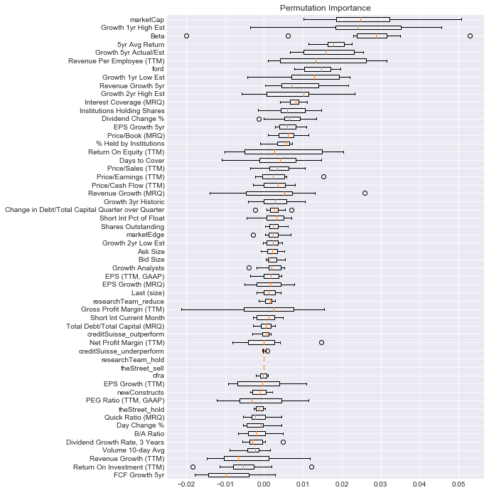

# Quantitative Analysis with Machine Learning
Nate Cibik - Flatiron Module 5 Final Project - 2020/11/25

Project Links:
[Research Summary Blog Post](https://natecibik.medium.com/predicting-returns-with-fundamental-data-and-machine-learning-in-python-a0e5757206e8)
[Non-technical Presentation](https://youtu.be/UoUthOCWo9A)
[Web Scraper Repository](https://github.com/FoamoftheSea/tda_scraper) (see bot_functions.py in this repo)

## Overview
On May 8th, 2020, I deployed a web scraper on TD Ameritrade's website to gather all of the fundamental data available there on the securities in the S&P 500 at that time into a clean, Python-ready database of .csv files. Now, six months later, I performed an in-depth study on the ability of various machine learning algorithms to utilize it in a variety of regression/classification tasks which might provide a trading edge in the market.

Several target variables were modeled in order to see what kinds of questions the data could prove useful in answering. First, a value investing perspective was taken, in which the data were used to model the current trading prices of the securities at the time of the scrape. The logic behind this was that since markets are mostly efficient in reflecting the underlying value of assets, creating a model which regresses the current trading prices of securities could take the place of an asset pricing model in a value investing strategy, such as the Capital Asset Pricing Model (CAPM), in evaluating the intrinsic value of securities. The residuals from such a model could be used to represent margins of safety in such a strategy, and the hypothesis was that these residuals would show a linear relationship to the log returns of the securities since the date of the scrape. This hypothesis was not supported by the results of the investigation, which can be found in the first notebook: modeling_current_price.ipynb. Modifying the approach or changing the length of the time period for this investigation may give better results in the future. The benefit in attempting to use this type of model is that it does not use future pricing information as a target, but instead only as a verification of the efficacy of the model residuals in predicting those price movements.

The above is the linear regression of the log returns using the asset pricing model residuals. The p-value for the coefficient between the two variables is not significant at .186. Notice that the distribution of the residuals is extrememly tight, which is the result of predicting prices for assets which the model saw during training. Future work needs to be done on holdout sets to see how this might affect the results.

The other three target variables that were modeled were all related to the log returns of the securities since the date of the scrape. First, the continuous values of the log returns were regressed using a variety of machine learning algorithms, with lackluster results. Then, two binary categorical variables were derived from the log returns, the first being a gainers/losers classification (above/below 0), and the second being an over/under performer relative to the index classification (above/below index mean). It was concluded that the prior was a flawed method of classification, because class membership is highly influenced by the direction of the market at for any given time period, obfuscating the role of the explanatory variables in predicting class. By subtracting the average return of the index from the log returns of each of the securities, the distribution of returns was centered around zero, so that the model could focus on determining the differences between securities which under or overperformed the market, which could prove to be a more robust insight in future market conditions. Multiple classifiers were tested in their ability to accurately predit the members of these categories during the time period of study, the classifiers from the xgboost package proved most useful in this task. While the chance of selecting an overperforming stock from the test set was 53%, the classifier predicted the correct class 69% of the time. The predicted probabilities were also shown to have a slight but significant linear relationship to the log returns. While improvement on this accuracy would be desirable, it is much better than random, and when combined with a long/short equity portfolio strategy, could prove to offer a consistently profitable portfolio allocation method.

I will take a moment to expand on the idea of combining the predictive power of the model with the long/short equity strategy. If the investor uses the model to predict which securities will over or under perform the market, they can then create an even-dollar value long/short hedge strategy, where they go long in securities that were predicted to overperform, and short in securities that were predicted to underperform, in equal dollar amounts. When this is done with a large enough number of different securities, it offers position concentration and market risk management, since the large number of positions diversifies the risk exposure, and the short positions hedge against the market-induced movements of the long positions. If the classes are evenly split, and one were to pick stocks at random, this would be expected to go no where. However, if one is predicting over or underperformance with better than random chance, then the movements of the market will always work in their favor, since whichever direction they are profiting from would be augmented with having been allocated with securities expected to be on the same side of the market movement. Further, since the predicted probabilities of class 1 generated by the model have a significant linear relationship with the returns, the portfolio can favor predicted probabilities on the extremes if the investor does not want to buy all stocks in the index. A demonstration of the effects of combining this strategy with the model predictions, as well as all the work related to modeling the returns, can be found in modeling_returns.ipynb.

Above we can see the performance of the long/short portfolio against a buy & hold strategy of the test set. The portfolio had smaller returns, but much lower volatility, and was also hedged against market risk. We can see the behavior of the long and short sides of the portfolio below.

In order to show why a sacrificing potential returns for a hedging strategy is worthwhile, a simulated bear market was created by reversing the returns of the S&P 500 over this time period, and tracking the performance of the same portfolio in these conditions. This behavior is shown below.

We can see that even in a market downturn, the portfolio has made gains. We can see the mechanics of this below.

## Contents
Here is a list of the essential files in this repository, with a brief description of each.

- modeling_current_price.ipynb -> Notebook containing all work related to modeling asset price.
- modeling_returns.ipynb -> Notebook containing all work related to modeling return-based targets.
- watchlist_scraping.ipynb -> A demonstration of the process of running the web scraper.
- bot_functions.py -> All python code to run the web scraper. The bot does not currently work.
- my_functions.py -> Miscellaneous useful functions that I use for projects.
- sp500.csv -> List of S&P 500 tickers which were used for the scrape and in the notebooks.
- data/ -> All of the data from the deployment of the web scraper on May 08, 2020.
- images/ -> All exported images.

## External Links
To read the blog post which covers the research undertaken in this repository, click [here](https://natecibik.medium.com/predicting-returns-with-fundamental-data-and-machine-learning-in-python-a0e5757206e8).